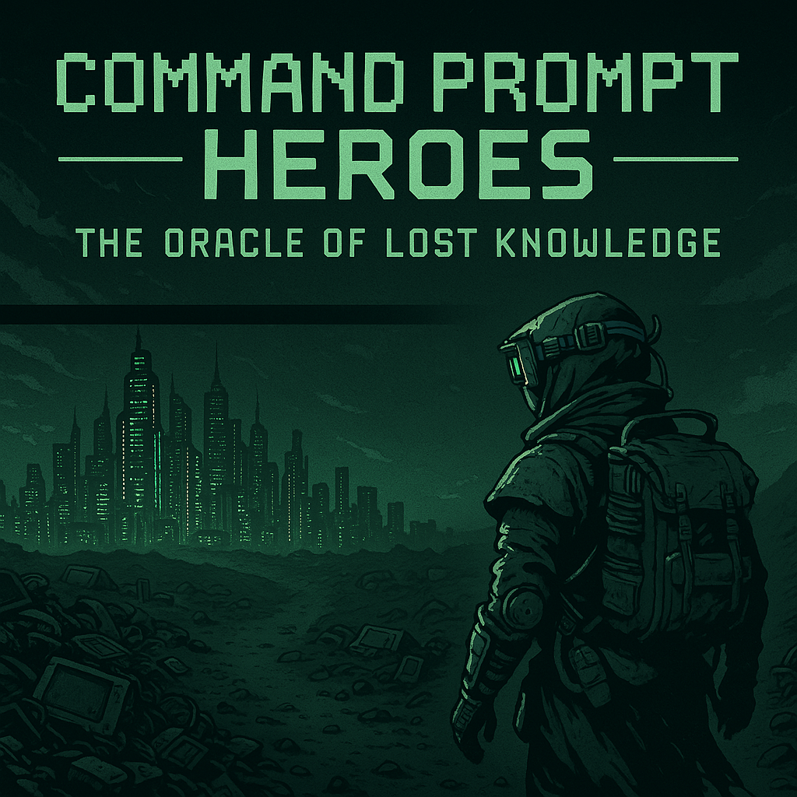
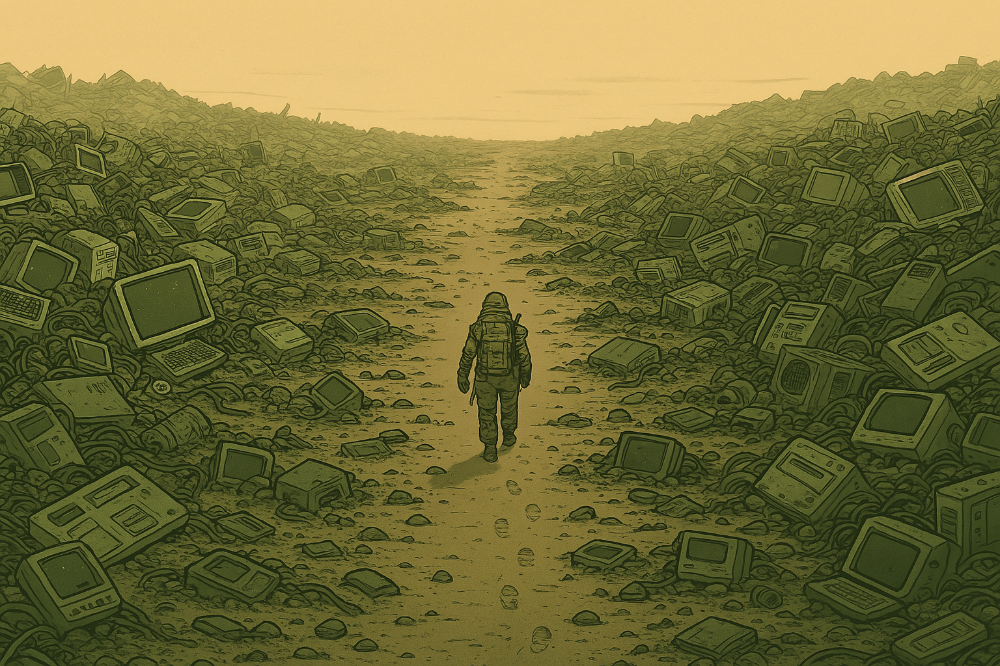
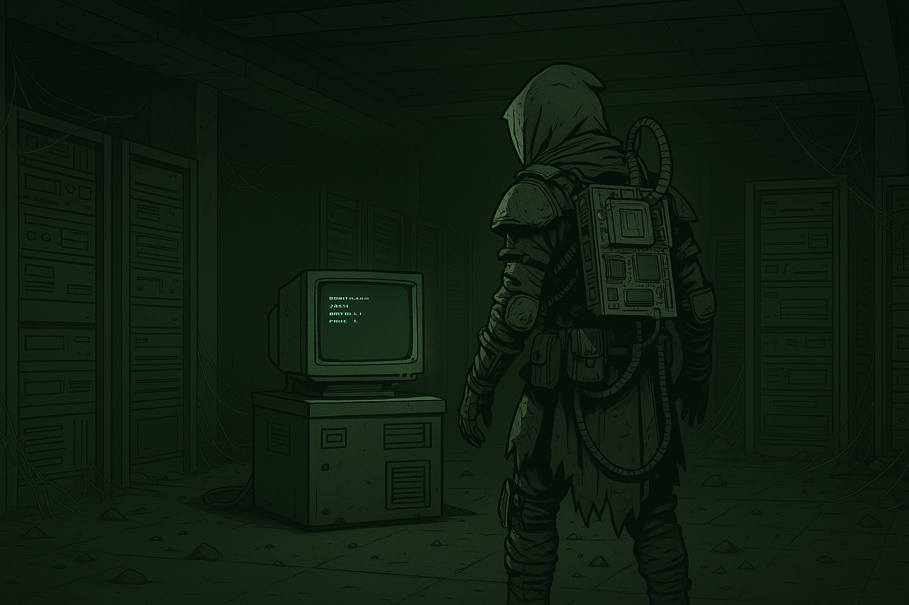
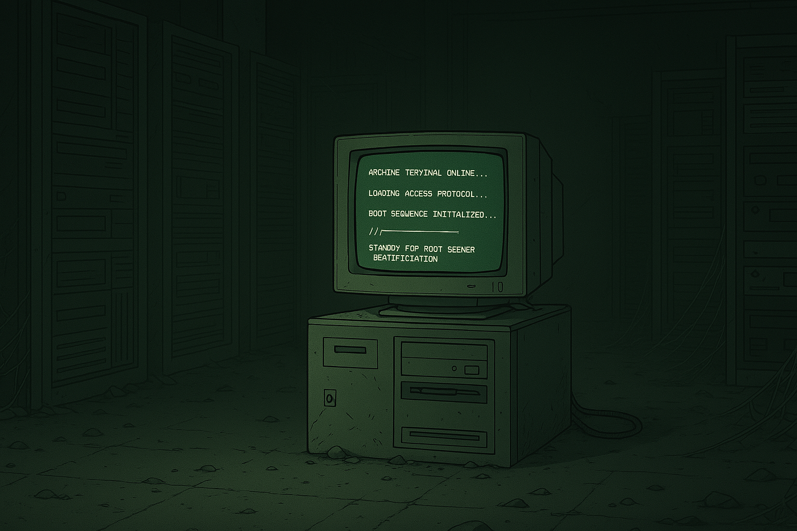
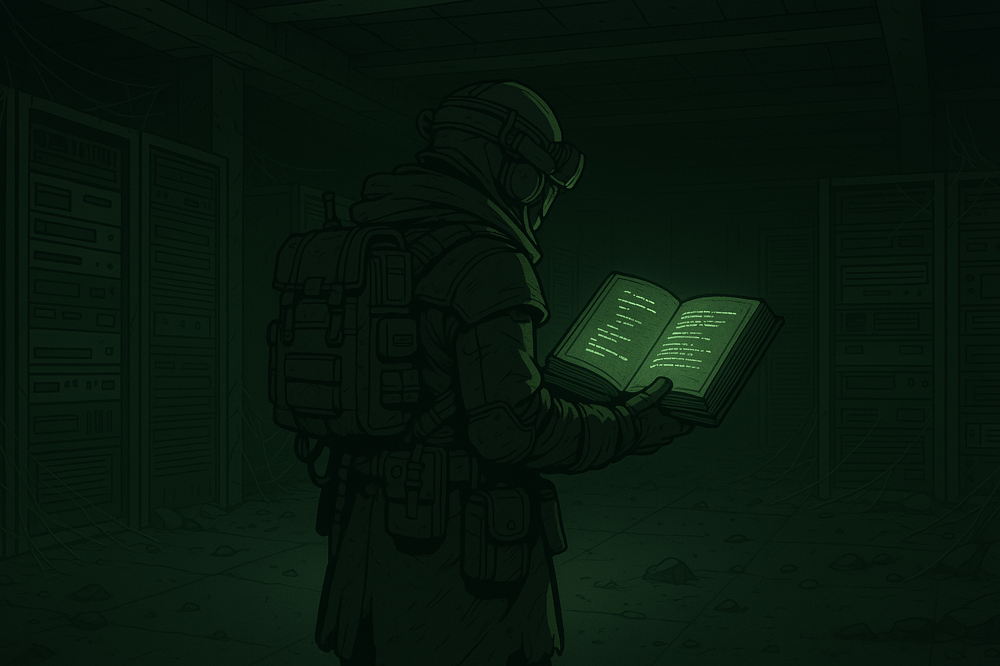
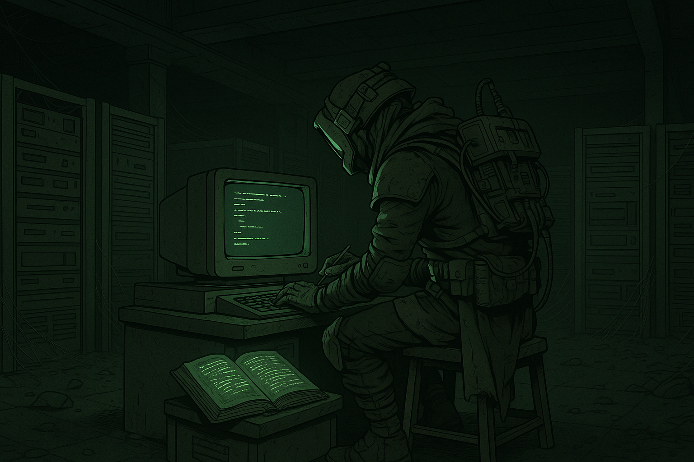
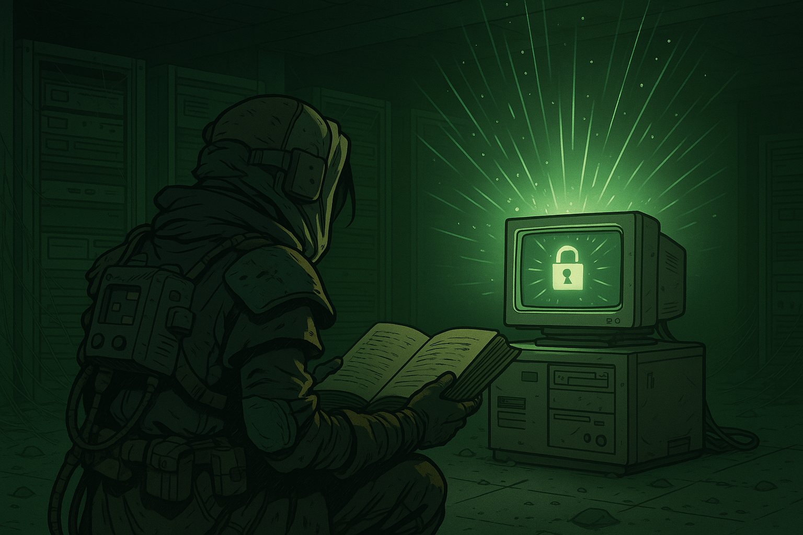
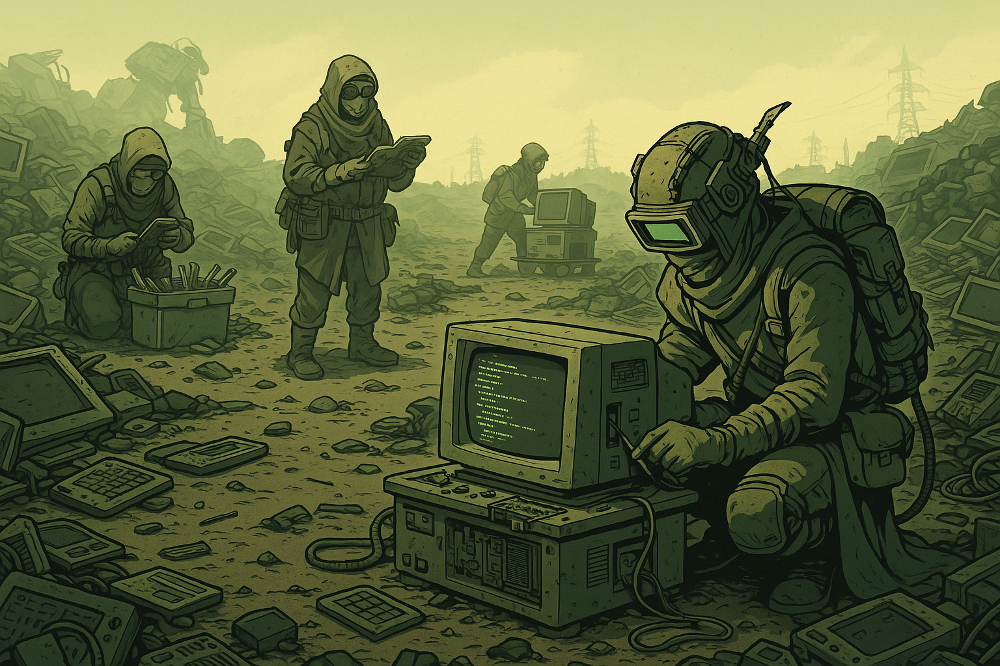

Intro Narrative: The Oracle of Lost Knowledge

---

In the not-so-distant future, everything runs on AI.
It answers your emails. It balances your spreadsheets. It even writes your meeting notes—before you attend the meeting.

It’s fast. It’s efficient.
But over time… something strange happened.

People forgot how things actually worked.

No one remembered how to fix the systems.
Or how to build new ones.
Pushing a button to turn on a device started to feel like magic.

**beat**

But out beyond the city, beyond the polished glass and solar towers…
There are explorers.

Quietly curious. Dangerously clever.
People like you—techno-scavengers who wander the ruins in search of lost technology, looking for answers to questions no one remembers how to ask.

---

And one day, you found something.
A staircase.
A humming room beneath the dust.
And in the center: a glowing green screen.

A single line of text flickers to life:

THE ORACLE OF LOST KNOWLEDGE

---

The Oracle isn’t just a computer.
It’s a connection to everything we lost.
Part AI, part archive, part weirdly preserved YouTube playlist—
It contains the skills and knowledge that once powered the world.

But it’s locked.
No touchscreen. No smart assistant.
If you want to use it, you’ll have to go old school.

---

Thankfully, beside it sits a massive book—
Dusty, duct-taped, and giving off a soft green glow:

THE TOME OF WISDOM

---

Inside? Step-by-step lessons in command line, Python, and a few forgotten tricks of the trade.

---

If you learn them,
If you take the time to study…
You just might unlock the Oracle.

---

And help the world remember how to build again.

