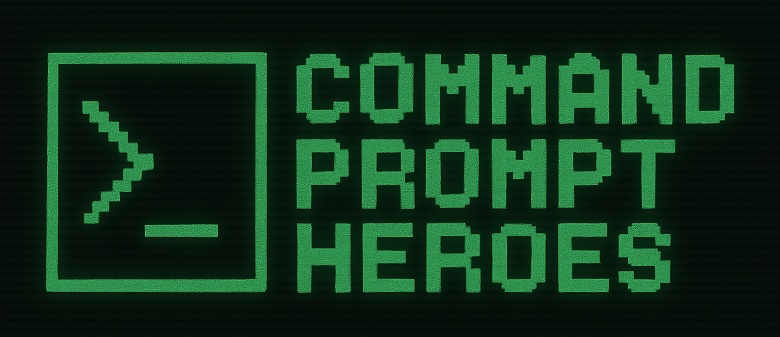
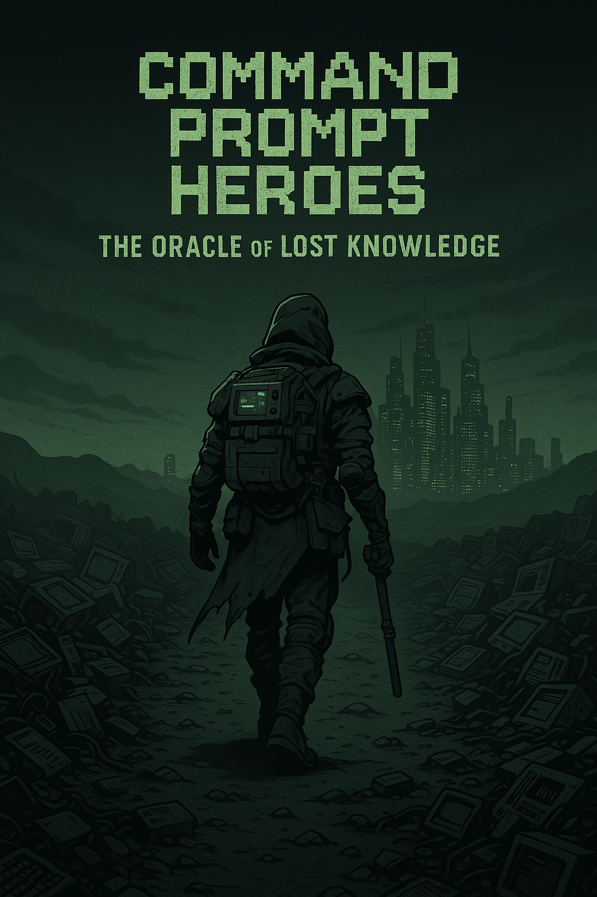

# Command Prompt Heroes — Companion Game

**Command Prompt Heroes** is the official mini-game companion to the *Command Prompt Heroes: The Oracle of Lost Knowledge* workshop. Designed as both a warm-up and a celebration, it helps participants internalize Command Prompt literacy through fast-paced play and retro-inspired visuals.

---

## What Is It?

A retro-style terminal emulator game where players have 60 seconds to type as many valid commands as they can remember. The more correct commands you enter, the higher your score. It tracks performance and gives instant feedback.

---

## How It Fits Into the Workshop

| Phase | Role |
|-------|------|
| **Before the Workshop** | Low-pressure, fun intro that gets people in the mindset. Most participants will score low at first. |
| **During the Workshop** | Mentions and visuals tie the game and workshop together. Players are *Command Prompt Heroes* in both worlds. |
| **After the Workshop** | Players re-attempt the game and usually get higher scores. This reinforces what they’ve learned and creates a satisfying payoff. |

---

## Learning Goals

- Reinforce muscle memory of core terminal commands
- Build fluency in recognizing valid CLI syntax
- Promote experimentation and curiosity
- Track progress from "newbie" to "hero"

---

## Gameplay Mechanics

- 60-second rounds
- Player types as many correct commands as possible
- Real-time feedback: green for correct, red for invalid
- Includes commands from:
  - Bash (Linux/macOS)
  - Windows CMD
  - Git
  - Docker
  - Kubernetes
- Include language keywords and built-ins from:
  - Python
  - JavaScript
- Final score displayed with a retro terminal animation

---

## Leaderboard (Optional Feature)

- Score submission is anonymous (or first name only)
- Can be displayed in the room on a secondary screen
- Encourages replay and friendly competition

---

## Designed For

- First-time coders and terminal users
- People attending the *Command Prompt Heroes* workshop
- Anyone who enjoys arcade-style typing games with a nerdy twist

---

## Tech Stack

- HTML + CSS (CRT screen aesthetic)
- JavaScript for game logic

---

---

## Credits & Style

Inspired by:
- Vintage hacker interfaces
- CRT monitors and BBS terminals
- Classic arcade scoring systems

Part of the **Command Prompt Heroes** learning universe.

