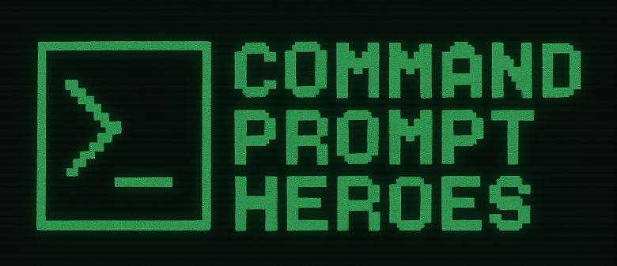
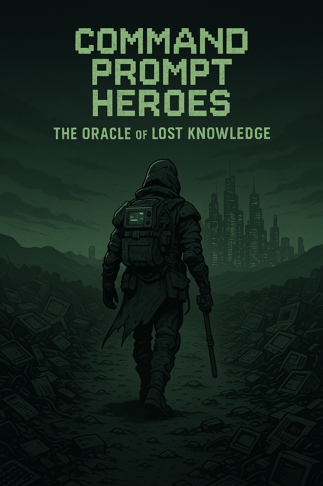

# Command Prompt Heroes — Companion Game

**Command Prompt Heroes** is the official mini-game companion to the *Command Prompt Heroes: The Oracle of Lost Knowledge* workshop. Designed as both a warm-up and a celebration, it helps participants internalize Command Prompt literacy through fast-paced play and retro-inspired visuals.

---

## What Is It?

A retro-style terminal emulator game where players have 60 seconds to type as many valid commands as they can remember. The more correct commands you enter, the higher your score. It tracks performance and gives instant feedback.

---

## How It Fits Into the Workshop

| Phase | Role |
|-------|------|
| **Before the Workshop** | Low-pressure, fun intro that gets people in the mindset. Most participants will score low at first. |
| **During the Workshop** | Mentions and visuals tie the game and workshop together. Players are *Command Prompt Heroes* in both worlds. |
| **After the Workshop** | Players re-attempt the game and usually get higher scores. This reinforces what they’ve learned and creates a satisfying payoff. |

---

## Learning Goals

- Reinforce muscle memory of core terminal commands
- Build fluency in recognizing valid CLI syntax
- Promote experimentation and curiosity
- Track progress from "newbie" to "hero"

---

## Gameplay Mechanics

- 60-second rounds
- Player types as many correct commands as possible
- Real-time feedback: green for correct, red for invalid
- Includes a dynamic library of commands from multiple ecosystems.
- Final score displayed with a retro terminal animation.

### Demo Mode

For a bit of fun, a hidden "demo mode" can be activated by entering the Konami code (`Up, Down, Up, Down, Left, Right, Left, Right, B, A, Enter`) during gameplay. When activated:

- The game will play itself in a continuous loop, entering random commands from the library.
- The "DEMO MODE" indicator will appear at the top of the screen.
- Scores achieved in demo mode are not saved to the leaderboard.
- To exit demo mode, press the `Escape` key. This will stop the demo and return you to the main menu.

---

## Leaderboard Features

- **Anonymous or Named Scores:** Players can submit their scores with their name (up to 10 characters) or anonymously.
- **Total Games Played:** The leaderboard tracks and displays the total number of games played since the last reset.
- **Data Management:**
  - **Download Data:** Download a JSON file of all leaderboard scores and game stats.
  - **Reset Data:** Clear all scores and stats from local storage.

---

## Extensibility

The game is designed to be easily extended with new command ecosystems. To add more commands:

1.  Open the `commands.js` file.
2.  Add a new key to the `commandDatabase` object (e.g., `"PowerShell"`).
3.  Add an array of command strings for the new ecosystem.

The instructions page will automatically update to include the new ecosystem in its list.

---

## Deployment

This project is configured for easy deployment to GitHub Pages using a GitHub Actions workflow.

1.  **Push to GitHub:** Commit and push the project to the `main` branch of your GitHub repository.
2.  **Enable Pages:** In your repository's settings, navigate to the "Pages" section.
3.  **Set Source:** Change the deployment source to "GitHub Actions".

After these steps, every push to the `main` branch will automatically build and deploy the `game` directory to your GitHub Pages site.

---

## Tech Stack

- HTML + CSS (CRT screen aesthetic)
- JavaScript for game logic

---

## Credits & Style

Inspired by:
- Vintage hacker interfaces
- CRT monitors and BBS terminals
- Classic arcade scoring systems

Part of the **Command Prompt Heroes** learning universe.
